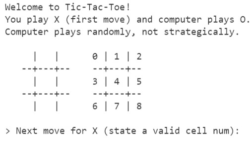
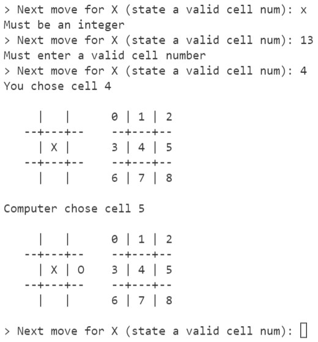
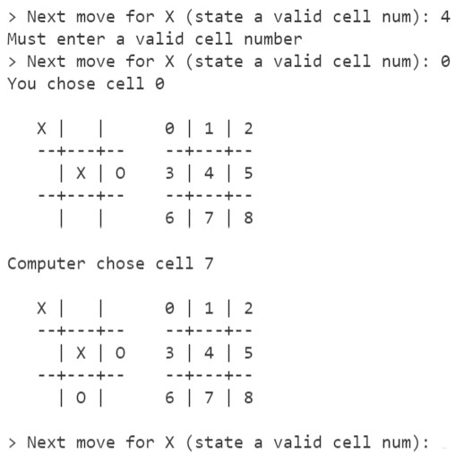
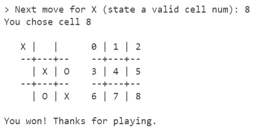

# Lab 2
## Implementing Tic-Tac-Toe game 

In this lab, you will implement a command-line tic-tac-toe game (https://en.wikipedia.org/wiki/Tic-tac-toe). The game is one player against the computer, for simplification, the computer makes valid moves randomly not intelligently. You can use the randint method in the random module.

Watch this video as a demo for the game first:
https://youtu.be/BGwxJhKTUZ0 (Links to an external site.)

As mentioned before, follow the specification and print the messages and the board exactly as you see in the demo video and screenshots. 

Consider the following code template.

The class initializer/constructor is given (use as is) as well as the main superloop code for running the game (use as is). You are to use the two data fields (self.board and self.played) in your code (they are updated after every move during the game, and must be current at any state of the game). See the code for the comments.

You are to complete the requested methods in the TicTacToe class and submit your code as a `Lab2.py` file.

```python
# student name:
# student number: 
import random

class TicTacToe:
    def __init__(self): # Use as is
        """ initializes data fields (board and played) 
            and prints the banner messages 
            and prints the initial board on the screen
        """
        self.board = [' '] * 9 # A list of 9 strings, one for each cell, 
                               # will contain ' ' or 'X' or 'O'
        self.played = set()    # Set (of cell num) already played: to keep track of the played cells 
        print("Welcome to Tic-Tac-Toe!")
        print("You play X (first move) and computer plays O.")
        print("Computer plays randomly, not strategically.")
        self.printBoard()

    def printBoard(self) -> None:
        """ prints the board on the screen based on the values in the self.board data field """
        pass #To Implement

    def playerNextMove(self) -> None:
        """ prompts the player for a valid cell number; 
            error checks that the input is a valid cell number; 
            and prints the info and the updated self.board;
        """
        pass #To Implement

    def computerNextMove(self) -> None:
        """ computer randomly chooses a valid cell, 
            and prints the info and the updated self.board 
        """
        pass #To Implement

    def hasWon(self, who: str) -> bool:
        """ returns True if who (being passed 'X' or 'O') has won, False otherwise """
        pass #To Implement

    def terminate(self, who: str) -> bool:
        """ returns True if who (being passed 'X' or 'O') has won or if it's a draw, False otherwise;
            it also prints the final messages:
                 "You won! Thanks for playing." or 
                 "You lost! Thanks for playing." or 
                 "A draw! Thanks for playing."  
        """
        pass #To Implement

if __name__ == "__main__":  # Use as is
    ttt = TicTacToe()  # initialize a game
    while True:
        ttt.playerNextMove()            # X starts first
        if(ttt.terminate('X')): break   # if X won or a draw, print message and terminate
        ttt.computerNextMove()          # computer plays O
        if(ttt.terminate('O')): break   # if O won or a draw, print message and terminate
```

At the beginning of the game the following banner is printed and then the game starts by allowing the player to state a move. The player is X (first move) and the computer is O.



The move is stated by the number of a valid cell. If the number is not valid (already taken, or not between 0 and 8) or if it is not a number, the game should display the error message (as shown) and repeat asking for the next move.



In the above image, the computer immediately made a move by choosing a valid cell number randomly and then it displays the updated board.

If we choose a cell number that is already taken, an error message "Must enter a valid cell number" is printed and it will again prompts for an input.



The game continues until either the player or the computer wins, or it is a draw. The game prints a final message: either of `“You won! Thanks for playing.”` or `“You lost! Thanks for playing.”` or `“A draw! Thanks for playing.”` messages, and it terminates.


