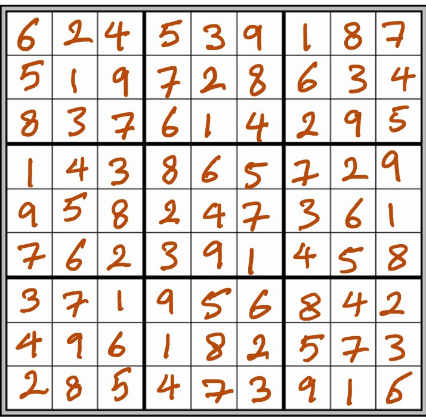
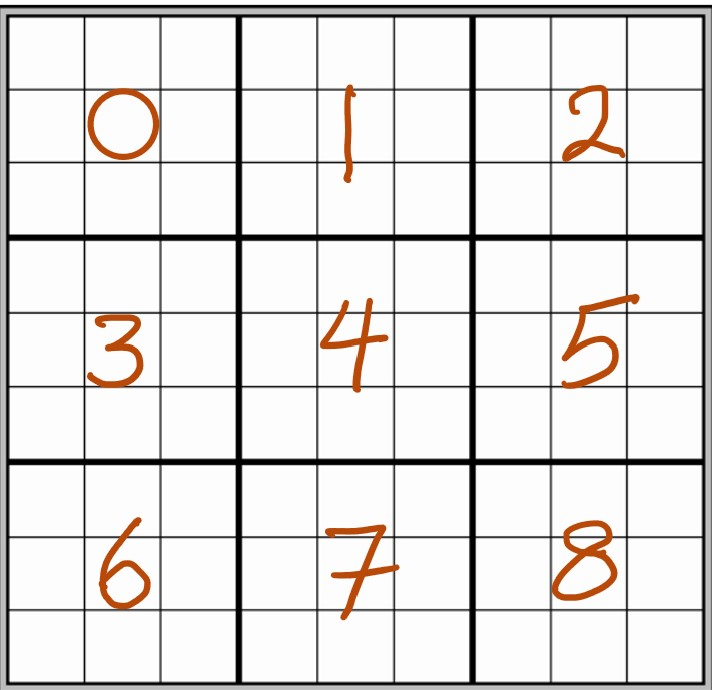

# Lab 3
## A Sudoku Solution Validator

In this lab we will implement a sudoku solution validator in two ways. We first write a single process version of the complete program, and then we will also rewrite it so that the validation tasks are done using multiple processes, each responsible only for a portion of validating the puzzle.

For consistency and fairness, you are not allowed to use other modules such as `numpy`, ...

Note: We will later learn inter-process communication, but for this lab, we will suffice to printing the result on the console.

A Sudoku puzzle uses a 9 x 9 grid in which each column, each row, as well as each of the nine 3 x 3 subgrids must contain all of the digits 1 to 9.

The following shows an example of a valid completed sudoku Sudoku. 



We will store a puzzle in a list (well, a list of lists), where each of the inner lists contains one row of the puzzle.

For example the above puzzle is stored as follows:

```python
test1 = [ [6, 2, 4, 5, 3, 9, 1, 8, 7],
          [5, 1, 9, 7, 2, 8, 6, 3, 4],
          [8, 3, 7, 6, 1, 4, 2, 9, 5],
          [1, 4, 3, 8, 6, 5, 7, 2, 9],
          [9, 5, 8, 2, 4, 7, 3, 6, 1],
          [7, 6, 2, 3, 9, 1, 4, 5, 8],
          [3, 7, 1, 9, 5, 6, 8, 4, 2],
          [4, 9, 6, 1, 8, 2, 5, 7, 3],
          [2, 8, 5, 4, 7, 3, 9, 1, 6]
        ]
```

In order to validate a Sudoku puzzle, we follow the following straightforward strategy:

1. Checking that each column contains digits 1 through 9.
2. Checking that each row contains digits 1 through 9.
3. Checking that each of the nine 3x3 subgrids contains digits 1 through 9.

For ease of reference, we refer to each of the subgrids with a number between 0 through 8 with the following convention:



So for example, the subgrid 4 is the 3x3 subgrid right in the middle of the puzzle.

### Deliverables
* `Lab3_part1.py`
* `Lab3_part2.py`

### Part1:

Consider the following code template, which is a single-process version of our program:


```python
#student name:
#student number:

def checkColumn(puzzle: list, column: int):
    """ 
        param puzzle: a list of lists containing the puzzle 
        param column: the column to check (a value between 0 to 8)

        This function checks the indicated column of the puzzle, and 
        prints whether it is valid or not. 
        
        As usual, this function must not mutate puzzle 
    """
    pass #To implement

def checkRow(puzzle: list, row: int):
    """ 
        param puzzle: a list of lists containing the puzzle 
        param row: the row to check (a value between 0 to 8)

        This function checks the indicated row of the puzzle, and 
        prints whether it is valid or not. 
        
        As usual, this function must not mutate puzzle 
    """
    pass #To implement

def checkSubgrid(puzzle: list, subgrid: int):
    """ 
        param puzzle: a list of lists containing the puzzle 
        param subgrid: the subgrid to check (a value between 0 to 8)
        Subgrid numbering order:    0 1 2
                                    3 4 5
                                    6 7 8
        where each subgrid itself is a 3x3 portion of the original list
        
        This function checks the indicated subgrid of the puzzle, and 
        prints whether it is valid or not. 
        
        As usual, this function must not mutate puzzle 
    """
    pass #To implement


if __name__ == "__main__":
    test1 = [ [6, 2, 4, 5, 3, 9, 1, 8, 7],
              [5, 1, 9, 7, 2, 8, 6, 3, 4],
              [8, 3, 7, 6, 1, 4, 2, 9, 5],
              [1, 4, 3, 8, 6, 5, 7, 2, 9],
              [9, 5, 8, 2, 4, 7, 3, 6, 1],
              [7, 6, 2, 3, 9, 1, 4, 5, 8],
              [3, 7, 1, 9, 5, 6, 8, 4, 2],
              [4, 9, 6, 1, 8, 2, 5, 7, 3],
              [2, 8, 5, 4, 7, 3, 9, 1, 6]
            ]
    test2 = [ [6, 2, 4, 5, 3, 9 , 1, 8, 7],
              [5, 1, 9, 7, 2, 8, 6, 3, 4],
              [8, 3, 7, 6, 1, 4, 2, 9, 5 ],
              [6, 2, 4, 5, 3, 9 , 1, 8, 7],
              [5, 1, 9, 7, 2, 8, 6, 3, 4],
              [8, 3, 7, 6, 1, 4, 2, 9, 5 ],
              [6, 2, 4, 5, 3, 9 , 1, 8, 7],
              [5, 1, 9, 7, 2, 8, 6, 3, 4],
              [8, 3, 7, 6, 1, 4, 2, 9, 5 ]
            ]
    
    testcase = test1   #modify here for other testcases
    SIZE = 9

    for col in range(SIZE):  #checking all columns
        checkColumn(testcase, col)
    for row in range(SIZE):  #checking all rows
        checkRow(testcase, row)
    for subgrid in range(SIZE):   #checking all subgrids
        checkSubgrid(testcase, subgrid)
```

Complete all the functions in the code so that the program correctly identifies if a puzzle is valid or not. The program simply prints whether each row, each column and each subgrid is valid. If all valid, we can deduct that the Sudoku puzzle is valid, and not-valid otherwise.

Obviously, you are not to limit your testing to the two testcases provided in the template above.

A ***sample output*** of the program would be:

```
Column 0 not valid
Column 1 not valid
Column 2 not valid
Column 3 not valid
Column 4 not valid
Column 5 not valid
Column 6 not valid
Column 7 not valid
Column 8 not valid
Row 0 valid
Row 1 valid
Row 2 valid
Row 3 valid
Row 4 valid
Row 5 valid
Row 6 valid
Row 7 valid
Row 8 valid
Subgrid 0 valid
Subgrid 1 valid
Subgrid 2 valid
Subgrid 3 valid
Subgrid 4 valid
Subgrid 5 valid
Subgrid 6 valid
Subgrid 7 valid
Subgrid 8 valid
```

### Part2:

Use the code you completed for Part 1, and modify it so the main program uses the Python's multiprocessing module to create 27 processes to check for validity of the puzzle.

You must use the exact same functions you have completed in part1.

You are to:
1. use one process to check for the validity of one row (so 9 processes for the 9 rows)
2. use one process to check for the validity of one column (so 9 processes for the 9 columns)
3. use one process to check for the validity of one subgrid (so 9 processes for the 9 subgids)

The output should be the same as the one for part1, that is, each process will print whether the corresponding row or column or subgrid is valid or not. Note that the order of printing though would be different in part2 (since it depends on how the processes are scheduled, it depends on the number of available CPU cores, ...).

Notes and Hints:
* use: import multiprocessing
* use: multiprocessing.Process()
* use: start() and join() methods
* we are not using the Pool class in this lab, since it is a higher-level abstraction.
* we are using procedural paradigm for the code in this lab. It is not required here but it is easy to rewrite the code using OOP. 
* all child processes are non-daemonic. 

Write the best code you can. For the marking, we check that the program works, has correct logic, follows the specs, and passes all our tests. The program should be readable (good choice of identifiers, acceptable structure and styling, useful comments wherever needed ...), and does not do any repetitive work or extra work unnecessarily.